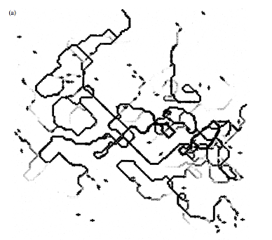
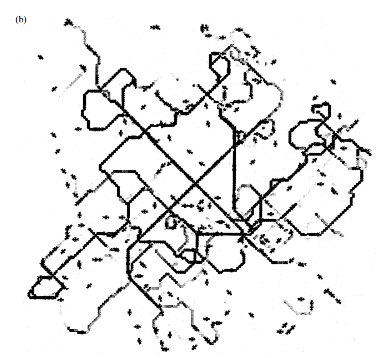
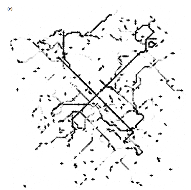
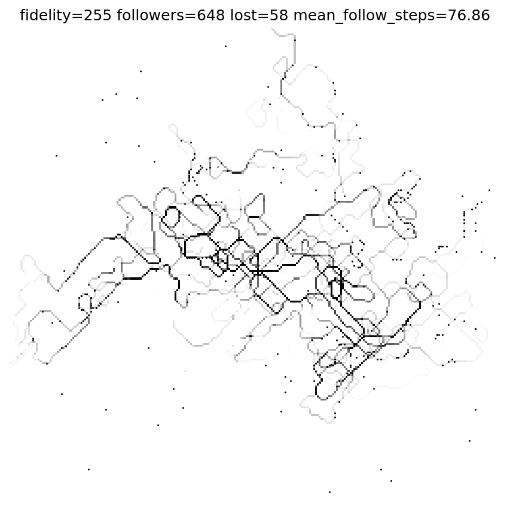
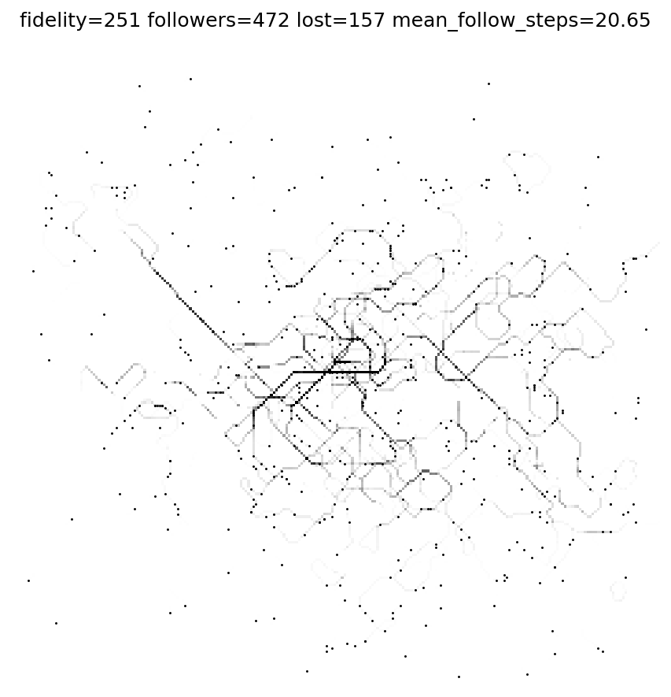
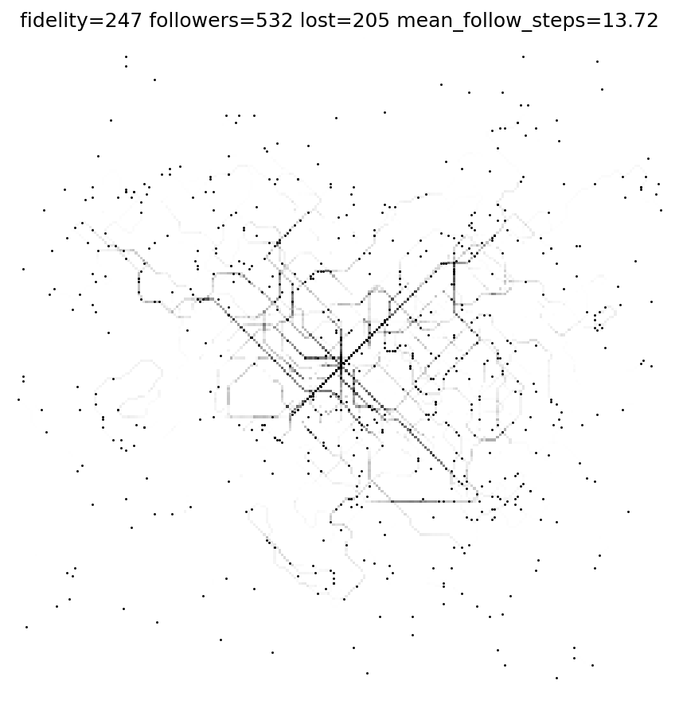

# Ant Trail Formation Model

## Project Overview
The goal of this project is to reproduce the ant trail simulation described in **Watmough & Edelstein-Keshet (1995), _Modelling the Formation of Trail Networks by Foraging Ants_.**

The benchmark is **Figure 3** of the paper, which examines how trail structure changed based on ant fidelity to pheromone trails.

---

## Repository Structure
- `main.py`: entry point for running simulations
- `antsim.py`: simulation logic
- `checks.py`: tests to ensure simulation is running as expected
- `output/`: generated figures from this implementation
- `media/`: reference images from the paper for comparison

---

## Benchmark Comparison: Figure 3
### Target behavior
Figure 3 in Watmough & Edelstein-Keshet (1995) shows trail networks formed under
different constant fidelity values while holding other parameters fixed.  
Key features include:
- A "forward bias" during fork encounters
- Decrease in Follower-to-Lost ratio as fidelity decreases
- Shorter mean distance that an ant follows a trail at lower fidelity values

### Results from this implementation
## Parameter Settings
- Grid size: 256 × 256
- Time steps: 1500
- Deposition rate `t`: 8
- Turning kernel `B`: (0.360, 0.047, 0.008, 0.004)
- Fidelity values: 255, 251, 247
#### Figure 3 Benchmark

#### Figure 3a Implementation

#### Differences and limitations
- The total number of ants released is not specified. It is also not explicitly stated whether the number will have a significant impact of results.
- The trail shapes are vaguely similar. However, while Follower-to-Lost ant ratio and the mean distance an ant follows a trail aligns with the general pattern as the benchmark, the numbers do not fully match. For all fidelities, both values are lower than expected.
- It is not a complete reproduction of the paper’s Figure 3 outputs and cannot be considered a scientific tool that is reflective of biology.
#### Capabilities and Uses
- The difference between fidelity values is clear, and the code could be useful for users to explore different parameters and inputs. 
  
---
### Requirements
- Python
- Libraries:
  - `numpy`
  - `matplotlib`
